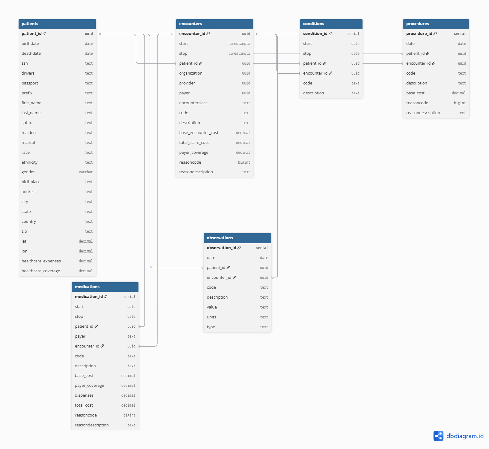

# Healthcare Analytics
### 📌 Overview
This project analyzes synthetic healthcare data to uncover patient demographics, condition prevalence, medication usage, hospital stay patterns, procedure demand, and year-over-year trends. The goal is to simulate real-world healthcare analytics and demonstrate SQL, data modeling, and visualization skills.

### 📊 Dataset
The dataset includes anonymized healthcare records with the following entities:
- Patients → demographic information (birthdate, gender, city, etc.)
- Conditions → medical conditions diagnosed per patient
- Medications → prescriptions issued to patients
- Encounters → hospital visits, admissions, and length of stay
- Procedures → medical procedures performed

The dataset is generated from Synthea, an open-source synthetic patient generator. It provides realistic but fully synthetic healthcare records (no real patient data).

Download: [Synthea GitHub Releases](https://synthea.mitre.org/downloads) - **COVID-19 10K, CSV | [mirror]: 54 MB**

Data format: CSV files for patients, conditions, medications, encounters, and procedures
Database: The CSVs were imported into PostgreSQL and structured following the provided [SQUEMA](sql/SCHEMA.sql)

⚠️ Note: The raw CSV files are not included in this repository due to size limits. Please download them directly from the official Synthea project and load into PostgreSQL to reproduce the analysis.

### 🛠️ Tools & Technologies
- PostgreSQL → database storage and querying
- SQL (CTEs, Window Functions, Aggregations) → data analysis
- Power BI → interactive dashboards and data visualization
- dbdiagram.io → Entity Relationship Diagram (ERD)

### ❓ Key Business Questions
1. What is the distribution of patients by age group and gender?
2. What are the most common medical conditions?
3. How does medication usage vary by age group, gender, and geography?
4. What are the typical hospital stay durations for different conditions?
5 Which procedures are most common in each city?
6. How do conditions grow or decline year-over-year by age group?

All these questions are analysed on [Analysis resume](Analysis_resume.md)
for queries [Analysis](sql/Analysis.sql)

### 📂 Repository Structure
- docs/                  → ERD
- images/                → screenshots of dashboards (Power BI) and query results (pgAdmin)
- sql/                   → database schema, load script, and analysis queries
- Analysis_resume.md     → All queries analysis used for this repository
- README.md              → project summary and instructions  

### 🔗 Relationships (ERD)
The database schema connects patients with their encounters, conditions, medications, and procedures. The ERD is included in the /docs folder for visualization of table relationships.

### 🔄 How to Reproduce
- Create a PostgreSQL database:
      * In pgAdmin → right-click Databases → Create - Database → name it `Healthcare` (or any name you preffer).
- Schema & Data Import:
      * Run the schema script in [SCHEMA](sql/SCHEMA.sql) to create all tables and insert data.
- Sample queries:
      * Analytical SQL queries are available in [Analysis](sql/Analysis.sql).
      * These queries can be run in pgAdmin or connected directly to Power BI for visualization.

### 📈 Power BI Dashboard
An interactive dashboard was created in Power BI to visualize key insights such as patient demographics, condition and prescription prevalence, most observations on patients and some more. This dashboard translates SQL queries into intuitive charts for business users.

Overall sample: [Overall Chart](images/overall_dashboard.png)
