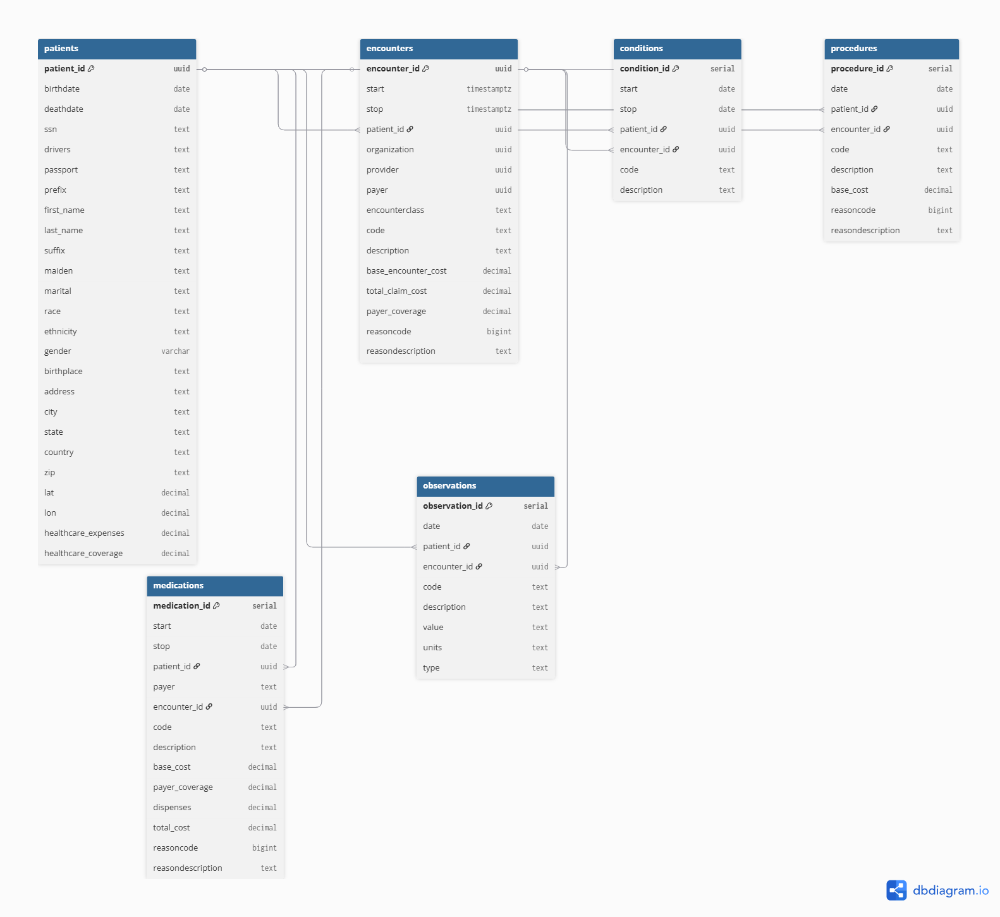

# 🏥 Healthcare Analytics

### 📌 Overview

This project analyzes synthetic healthcare data to uncover insights related to patient demographics, condition prevalence, medication usage, hospital stay patterns, procedure demand, and year-over-year trends.

The objective is to simulate a real-world healthcare analytics workflow and demonstrate skills in SQL, data modeling, and data visualization.

---

### 📊 Dataset

The dataset consists of anonymized healthcare records generated using **Synthea**, an open-source synthetic patient generator.

It includes the following entities:

* **Patients** → demographic information (birthdate, gender, location, etc.)
* **Encounters** → hospital visits and admission details
* **Conditions** → diagnoses per patient
* **Medications** → prescriptions issued
* **Procedures** → medical procedures performed
* **Observations** → clinical measurements

⚠️ This dataset is fully synthetic. No real patient data is used.

Download dataset:
https://synthea.mitre.org/downloads
Recommended: **COVID-19 10K (CSV ~54MB)**

---

### 🛠️ Tools & Technologies

* PostgreSQL → database design and querying
* SQL → CTEs, window functions, aggregations
* Power BI → dashboards and visualization
* dbdiagram.io → ERD design

---

### ❓ Key Business Questions

1. What is the distribution of patients by age group and gender?
2. What are the most common medical conditions?
3. How does medication usage vary across demographics and geography?
4. What are typical hospital stay durations by condition?
5. Which procedures are most common across cities?
6. How do conditions evolve year-over-year by age group?

---

### 📂 Repository Structure

* `docs/` → ERD diagram
* `images/` → query results and Power BI dashboards
* `sql/` → schema and analysis queries
* `analysis_resume.md` → explanation of analytical queries
* `README.md` → project documentation

---

### 🗄️ Database Schema

The database follows a patient-centric model:

* One patient → multiple encounters
* Each encounter → linked to conditions, medications, and procedures

📌 ERD:

---

### 🔄 How to Reproduce

1. Create a PostgreSQL database
2. Run:

   * `sql/schema.sql`
3. Load CSV files (update file paths as needed)
4. Run analysis queries:

   * `sql/analysis.sql`
5. (Optional) Connect Power BI for visualization

---

### 📈 Power BI Dashboard

The dashboard visualizes:

* Patient demographics
* Condition prevalence
* Medication patterns
* Geographic insights

Sample:
[Overall Dashboard](images/overall_dashboard.png)

---

### ✅ Key Takeaways

* Demographics strongly influence healthcare demand
* Chronic conditions are associated with longer treatment cycles
* Geographic patterns impact medication and procedure distribution
* Year-over-year trends help identify emerging health risks
